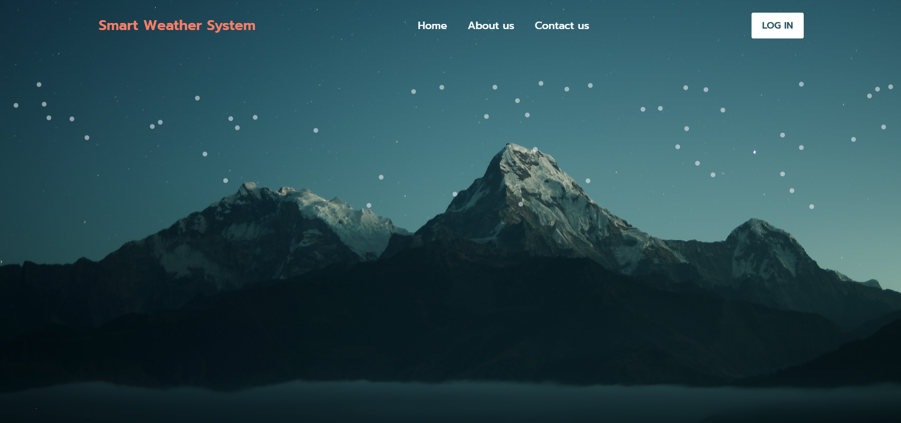
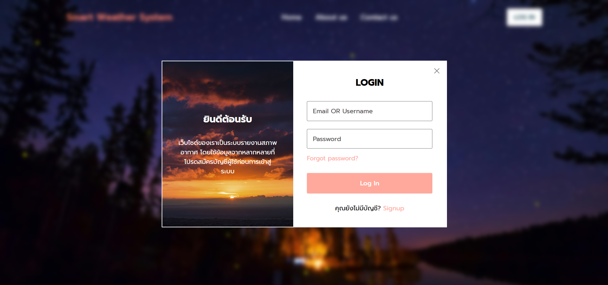

# 🌤️ Smart Weather System

ระบบ Smart Weather System พัฒนาขึ้นเพื่อจัดการและแสดงข้อมูลสภาพอากาศในประเทศไทยทั้ง 77 จังหวัด โดยรวมการดึงข้อมูลจาก API และให้ผู้ใช้สามารถเพิ่มข้อมูลที่เกี่ยวข้องได้ด้วยตัวเองผ่านระบบเว็บแอปพลิเคชัน

[🎬 ดูวิดีโอสาธิตระบบ (YouTube)](https://www.youtube.com/watch?v=x_xYv5QKPCM&t=749s)

---

## 🧠 ฟีเจอร์หลัก

- 📡 ดึงข้อมูลสภาพอากาศเรียลไทม์จาก API
- 🗺️ รองรับทั้ง 77 จังหวัดในประเทศไทย
- 👤 ระบบผู้ใช้งาน: เพิ่ม / ดู / แก้ไข / ลบข้อมูลสภาพอากาศ
- 🛠️ ฝั่ง Admin สามารถจัดการสิทธิ์และดูภาพรวมระบบได้
- 📈 แสดงกราฟวิเคราะห์ข้อมูล เช่น อุณหภูมิ, ความชื้น, ฝนตก

---

## 🌐 เทคโนโลยีที่ใช้

- Frontend | HTML, CSS, JavaScript |
- Backend | Node.js, Express.js |
- Database | MySQL |
- API | OpenWeatherMap, YouTubeAPI |

---

📸 ตัวอย่างหน้าจอระบบ

ภาพต่อไปนี้แสดงให้เห็นอินเทอร์เฟซการใช้งานของระบบ Smart Weather System ในแต่ละมุมมองหลัก ได้แก่ การเข้าสู่ระบบ, หน้าผู้ดูแลระบบ, และโครงสร้างการออกแบบระบบ

🔐 หน้าเข้าสู่ระบบ (Login Page)
ระบบมีหน้า Login สำหรับยืนยันตัวตนผู้ใช้งานก่อนเข้าถึงฟังก์ชันภายในระบบ

  
 
  

---
